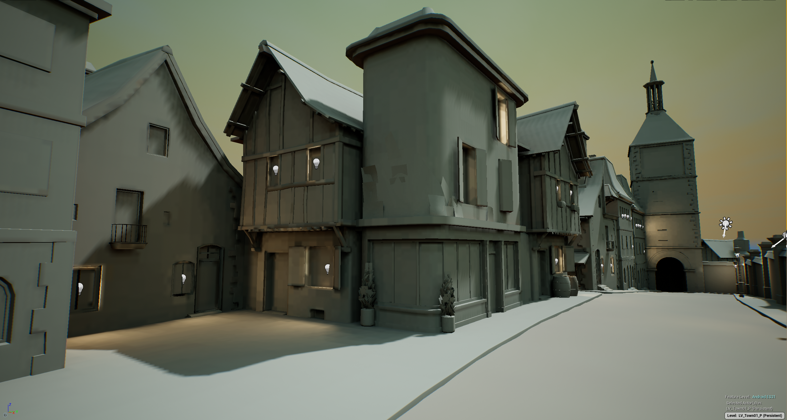
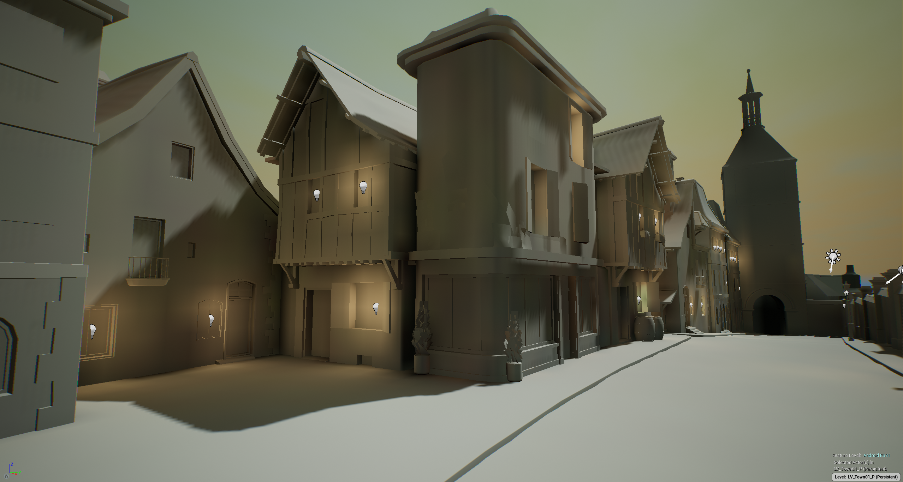
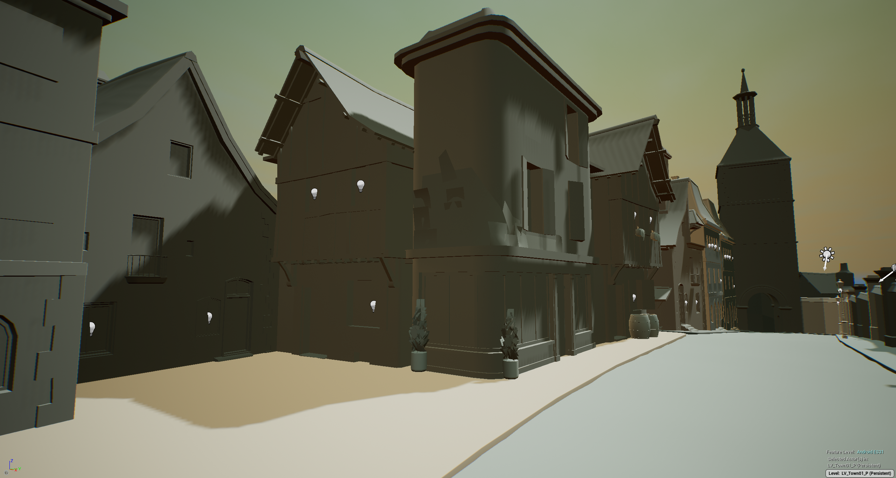

# Volumetric-PRT

移动平台光影优化，间接光方案、多光源等

* PRT TOD

    

Lightmap、PRT、Mobile VLM对比：

* LightMap

* LightMap Light Only

* PRT

* PRT Light Only

* Mobile VLM 逐物件

* Mobile VLM Light Only

下面是PRT在不同时间段对比：

上图是With PRT，下图是No PRT

6 AM:

2 PM:

7 PM:

